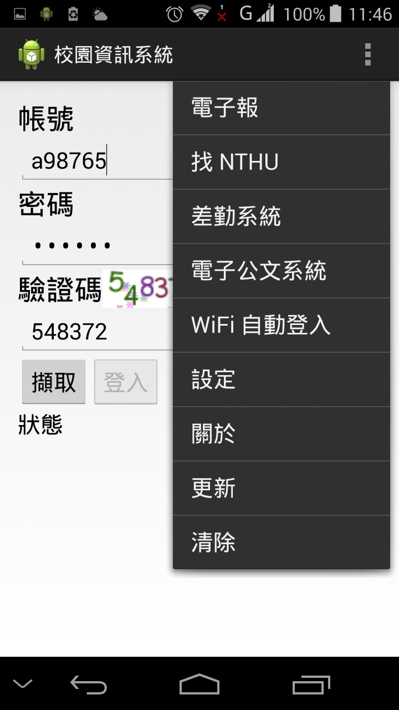

NTHU Campus Information System (Mobile)
=======================================
A campus information system for NTHU, included mailing list reader, wifi auto-login helper, etc.

Dependencies
------------
  * Android SDK (Android Support library)
  * Eclipse
  * jsoup: Java HTML Parser

Screenshot
----------

Author & Maintainer
-------------------
    SHIE, Li-Yi <lyshie@mx.nthu.edu.tw>

License
-------
    GNU General Public License (GPL)
